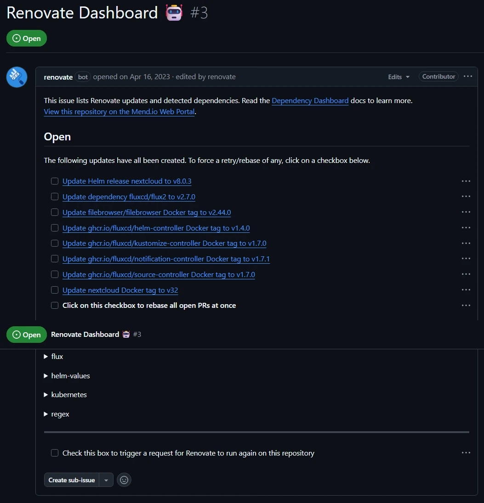

---
title: "GitOps on Kubernetes with FluxCD, SOPS, and Renovate"
date: 2025-09-30 00:59:00 +0000
categories: [Self-Hosting]
tags: [self-hosting,k8s,gitops,flux,fluxcd,sops,secrets]
pin: true
image:
  path: /assets/img/2025-09-30-gitops-on-kubernetes-with-fluxcd-sops-and-renovate/gitops.webp
  lqip: data:image/webp;base64,UklGRkoAAABXRUJQVlA4ID4AAAAQAgCdASoQAAgABUB8JbACdLoAAw73kVoAAP7kA2dbkdygZmBZ6ZDQIPMj4+QUJr9E9TPs9uI+Qz/owocAAA==
  alt: "GitOps on Kubernetes with FluxCD, SOPS, and Renovate"
--- 

I have been running most of my self-hosted services on Kubernetes in my home-lab for a while now. For [GitOps](https://about.gitlab.com/topics/gitops/) I have always preferred [Flux](https://fluxcd.io/) because of its simplicity and cloud native approach. Flux integrates seamlessly with [Renovate](https://www.mend.io/renovate/), [Helm](https://helm.sh/), [Kustomize](https://kustomize.io/) and [SOPS](https://github.com/getsops/sops). I did try [ArgoCD](https://argoproj.github.io/cd/), but the UI and the overall _ClickOps_ approach wasn't my cup of tea. My home lab uptime was reasonable until last month, when I _accidentally_ destroyed my entire cluster and had to rebuild everything from scratch (again!). Luckily my previous [post](https://surajremanan.com/posts/automating-talos-installation-on-proxmox-with-packer-and-terraform/) finally proved useful (that post is now updated too). While rebuilding the cluster, I realized my FluxCD documentation (or lack of it) was due for a rewrite. Instead of writing internal documentation which I never read, I decided to write this blog post and share it with the community.

What is [GitOps](https://about.gitlab.com/topics/gitops/), you might ask? It is a way to manage infrastructure and application deployments by storing the desired state and configuration in a Git repository, making Git the single source of truth. FluxCD automates pulling changes from that repository and applying them to your cluster, ensuring the live state always matches the state defined in the repository.

[FluxCD](https://fluxcd.io/) is an open source continuous delivery and GitOps tool designed to simplify and automate the deployment and lifecycle management of applications and infrastructure on Kubernetes. In this guide I will walk through installing and configuring FluxCD for GitOps using Flux's [example repository](https://github.com/fluxcd/flux2-kustomize-helm-example).

> If you want to skip the guide and just want to see my GitOps repo, [here](https://github.com/c0depool/c0depool-k8s-ops) is the link!
{: .prompt-info }

## Features

- [Flux CD](https://fluxcd.io/): GitOps operator for Kubernetes.
- [Sops](https://github.com/getsops/sops): Secret management.
- [Age](https://github.com/FiloSottile/age): Secret encryption.
- [Helm](https://helm.sh/): Kubernetes package manager.
- [Kustomize](https://kustomize.io/): Customize Kubernetes objects.
- [Renovate](https://www.mend.io/renovate/): Automated dependency updates.

## Prerequisites

- A Kubernetes cluster (can be single-node or multi-node, bare metal or cloud). I used my [Talos](https://www.talos.dev/) k8s v1.33.1 cluster for this guide. Check out [this post](https://surajremanan.com/posts/automating-talos-installation-on-proxmox-with-packer-and-terraform/) to see how I built it.  
- A [GitHub](https://github.com/signup) account. Flux works with any Git server, but I'm using GitHub for this guide.  
- A Linux VM to use as a workstation or bastion host. In this guide, I'm using Debian 11.
- Basic knowledge of Linux, containers, and Kubernetes.

## Prepare the workstation

1. On your linux workstation install the tools required for this guide. Let us start off with [Flux CLI](https://fluxcd.io/flux/installation/).
```bash
# WARNING: Please review the script at https://fluxcd.io/install.sh before executing it
curl -s https://fluxcd.io/install.sh | sudo bash
# Optional: Enable bash completion
echo ". <(flux completion bash)" | tee -a ~/.bashrc
source ~/.bashrc
flux -v
```
2. Install [Sops](https://github.com/getsops/sops).
```bash
# Find the latest version from https://github.com/getsops/sops/releases
curl -LO https://github.com/getsops/sops/releases/download/v3.10.2/sops-v3.10.2.linux.amd64
mv sops-v3.10.2.linux.amd64 /usr/local/bin/sops
chmod +x /usr/local/bin/sops
sops -v
```
3. Install [Age](https://github.com/FiloSottile/age).
```bash
sudo apt update
sudo apt install age
age -version
```
4. Install [Helm](https://helm.sh/).
```bash
curl https://baltocdn.com/helm/signing.asc | gpg --dearmor | sudo tee /usr/share/keyrings/helm.gpg > /dev/null
sudo apt-get install apt-transport-https --yes
echo "deb [arch=$(dpkg --print-architecture) signed-by=/usr/share/keyrings/helm.gpg] https://baltocdn.com/helm/stable/debian/ all main" | sudo tee /etc/apt/sources.list.d/helm-stable-debian.list
sudo apt-get update
sudo apt-get install helm
```

## Setup the Repository

1. For this guide, you'll need a repository to serve as your GitOps source of truth. Go to your GitHub account and create a [new repository](https://github.com/new).

2. Flux provides [this](https://github.com/fluxcd/flux2-kustomize-helm-example/) repository as an example scenario with two clusters: staging and production. You can use that, or my [home-lab repository](https://github.com/c0depool/c0depool-k8s-ops) which runs on a single cluster.
    > I recommend using the Flux example repository if you just want to get started. My repo includes the applications I personally use, so you may need to add or remove things based on your needs.
    {: .prompt-info }
```bash
# Cloning the repo to flux-k8s directory. Assuming flux-k8s is your repo name.
cd $HOME
git clone --depth=1 https://github.com/c0depool/c0depool-k8s-ops flux-k8s
cd flux-k8s
rm -rf .git
```
3. Now we need to update the repository according to our needs. Let us start by understanding the repository structure.
   - #### Directory Structure
   ```bash
   ├── apps
   │   ├── base
   │   │   ├── app-1
   │   │   │   ├── kustomization.yaml
   │   │   │   ├── namespace.yaml
   │   │   │   └── release.yaml
   │   │   └── app-2
   │   │       ├── kustomization.yaml
   │   │       ├── namespace.yaml
   │   │       └── release.yaml
   │   └── production
   │       ├── app-1-values.yaml
   │       └── app-2-values.yaml
   ├── clusters
   │   ├── c0depool
   │   │   ├── apps.yaml
   │   │   ├── config.yaml
   │   │   ├── flux-system
   │   │   │   ├── gotk-components.yaml
   │   │   │   ├── gotk-sync.yaml
   │   │   │   └── kustomization.yaml
   │   │   └── infrastructure.yaml
   │   └── config
   │       ├── cluster-config.yaml
   │       ├── cluster-secrets-encrypted.yaml
   │       └── kustomization.yaml
   ├── infrastructure
   │   ├── infra-component-1
   │   │   ├── kustomization.yaml
   │   │   ├── namespace.yaml
   │   │   └── release.yaml
   │   └── infra-component-2
   │       ├── kustomization.yaml
   │       ├── namespace.yaml
   │       └── release.yaml
   └── renovate.json5
   ```
   - #### Cluster Directory
     While bootstrapping flux, we should provide a directory where the flux configuration will be stored. In my repo I have used the `c0depool` directory as my cluster.
   ```bash
   ├── clusters
   │   ├── c0depool
   │   │   ├── apps.yaml
   │   │   ├── config.yaml
   │   │   ├── flux-system
   │   │   │   ├── gotk-components.yaml
   │   │   │   ├── gotk-sync.yaml
   │   │   │   └── kustomization.yaml
   │   │   └── infrastructure.yaml
   │   └── config
   │       ├── cluster-config.yaml
   │       ├── cluster-secrets-encrypted.yaml
   │       └── kustomization.yaml
   ```
     There are 3 main config files here:
       - `clusters/c0depool/config.yaml`: Kustomization manifest for the common cluster configuration directory. 
       - `clusters/c0depool/infrastructure.yaml`: Kustomization manifest for the infrastructure components.
       - `clusters/c0depool/apps.yaml`: Kustomization manifest for the application directories.
     
     Ignore the `flux-system` directory for now, as it will be created when you bootstrap Flux. We also have a `config` directory which has the cluster configuration and encrypted secrets. We will discuss it in detail later.
   - #### Apps Directory
   ```bash
   ├── apps
   │   ├── base
   │   │   ├── app-1
   │   │   │   ├── kustomization.yaml
   │   │   │   ├── namespace.yaml
   │   │   │   └── release.yaml
   │   │   └── app-2
   │   │       ├── kustomization.yaml
   │   │       ├── namespace.yaml
   │   │       └── release.yaml
   │   └── production
   │       ├── app-1-values.yaml
   │       └── app-2-values.yaml
   ```
     The apps directory contains the Helm release definitions and values for the applications running in the cluster.
       - `apps/base`: Namespaces and Helm release definitions for the applications.
       - `apps/production`: Helm release values for the production environment.
       
       As you can see, this repository can serve as the source for multiple clusters or environments. You can add more environments similar to `production` - just make sure each one has its own cluster configuration directory under the `clusters` folder. In my repository, the cluster `c0depool` is treated as the `production` environment.
   - #### Infrastructure Directory
   ```bash
   ├── infrastructure
   │   ├── infra-component-1
   │   │   ├── kustomization.yaml
   │   │   ├── namespace.yaml
   │   │   └── release.yaml
   │   ├── infra-component-2
   │   │   ├── kustomization.yaml
   │   │   ├── namespace.yaml
   │   │   └── release.yaml
   │   └── sources
   │       ├── bitnami.yaml
   │       ├── kustomization.yaml
   │       └── podinfo.yaml
   ```
     The infrastructure directory contains the common infra tools such as NGINX ingress controller, databases and Helm repository sources.
      - `infrastructure/infra-component-1`: Helm manifests as well as values for infrastructure components.
      - `sources`: Helm chart sources which will be referrenced by both infrastruture and application Helm release manifests.
4. Update the manifests in the repository according to your requirements.

## Encrypting Kubernetes Secrets

Most modern applications need secrets to function, such as credentials, passwords, keys, tokens, and certificates. While a Git repository is a good place to store configuration files, it should never be used to store unencrypted Kubernetes secrets because of security risks. Flux supports several options for [managing secrets](https://fluxcd.io/flux/security/secrets-management/), such as secret decryption operators, on-demand decryption, and secrets synchronized by operators. In this guide, we'll use Flux's on-demand decryption feature with SOPS and Age.

1. Create an Age key pair and note down your **public** key.
```bash
cd $HOME
age-keygen -o sops-key.txt
# open sops-key.txt and note down your public key
```
    > The file generated will contain your age secret key, make sure you store it somewhere safe. Without it, you cannot decrypt your encrypted secrets.
    {: .prompt-warning }
2. Add the Age private key to `flux-system` namespace as a secret.
```bash
kubectl create ns flux-system
kubectl -n flux-system create secret generic sops-age --from-file=age.agekey=sops-key.txt 
# Note: The secret name sops-age must be set as the spec.decryption.secretRef.name in your cluster manifests under the clusters directory in your repository.
```
3. Go to the previously cloned repository directory and update the `.sops.yaml` file with your Age **public** key.
```yaml
   creation_rules:
       - encrypted_regex: '^(data|stringData)$'
         age: '<Age public key>'
```
4. Add your application secrets to a kubernetes secret manifest `cluster-secrets-plaintext.yaml` with the values encoded in base64.
```bash
# Example
echo mysecretpassword | base64 -w 0
# And create a cluster-secrets-plaintext.yaml secret manifest
apiVersion: v1
kind: Secret
metadata:
  name: cluster-secrets
  namespace: flux-system
data:
  DB_PASSWORD: bXlzZWNyZXRwYXNzd29yZAo= # Encoded string
```
    > This file is not encrypted, make sure that it is never committed to your repository.
    {: .prompt-warning }
5. Encrypt the `cluster-secrets-plaintext.yaml` using Sops. The encrypted file `flux-k8s/clusters/config/cluster-secrets-encrypted.yaml` is safe to be committed to your repository.
```bash
cd $HOME
sops --config flux-k8s/.sops.yaml -e cluster-secrets-plaintext.yaml | tee flux-k8s/clusters/config/cluster-secrets-encrypted.yaml
```

## Bootstrap Flux

1. Generate a Personal Access Token for your Github repository. Open your Github page and navigate to Profile Settings → Developer settings → Personal access tokens → Fine-grained tokens [or Tokens (classic)] → Generate new token. If you are using fine-grained token, ensure that the token has read and write permissions to repository **contents**. Once generated, note down your token.

2. Commit and push the code to your repository.
```bash
cd $HOME/flux-k8s
git init
git add -A
git commit -m "pre-bootstrap of flux"
git branch -M main
git remote add origin https://github.com/<github_username>/flux-k8s.git # Update your github username
git push -u origin main
```
    > Make sure that your un-encrypted secrets are never committed to your repository.
    {: .prompt-warning }
3. Bootstrap Flux.
```bash
export GITHUB_TOKEN=<Your GitHub token>
cd $HOME
flux bootstrap github \
    --owner=<github_username> \
    --repository=<flux-k8s> \
    --path=clusters/c0depool \ # Change if you are using a different cluster name in your repository
    --personal
```
4. Wait for a few minutes for the Flux components to get installed. You can use below commands to check the status.
```bash
# Check the pods in flux-system namespace
kubectl get pods -n flux-system
# Should show the status of Flux system components.
# NAME                                       READY   STATUS    RESTARTS        AGE
# helm-controller-5c898f4887-tv8mt           1/1     Running   173 (11h ago)   94d
# kustomize-controller-7bcf986f97-gghls      1/1     Running   164 (11h ago)   76d
# notification-controller-5f66f99d4d-rplp4   1/1     Running   193 (11h ago)   94d
# source-controller-54bc45dc6-8mss7          1/1     Running   194 (11h ago)   87d
```
```bash
# Get all resources and statuses
flux get all
# All resources should show Ready as True.
# NAME                            REVISION                SUSPENDED       READY   MESSAGE
# gitrepository/flux-system       main@sha1:1e770d06      False           True    stored artifact for revision 'main@sha1:1e770d06'
# NAME                            REVISION        SUSPENDED       READY   MESSAGE
# helmrepository/bitnami          sha256:945a61d9 False           True    stored artifact: revision 'sha256:945a61d9'
# helmrepository/bitnami-oci                      False           True    Helm repository is Ready
# NAME                                    REVISION        SUSPENDED       READY   MESSAGE
# helmchart/demo-chart                    4.3.0           False           True    pulled 'demo-chart' chart with version '4.3.0'
# NAME                            REVISION                SUSPENDED       READY   MESSAGE
# kustomization/apps              main@sha1:1e770d06      False           True    Applied revision: main@sha1:1e770d06
# kustomization/config            main@sha1:1e770d06      False           True    Applied revision: main@sha1:1e770d06
# kustomization/flux-system       main@sha1:1e770d06      False           True    Applied revision: main@sha1:1e770d06
# kustomization/infrastructure    main@sha1:1e770d06      False           True    Applied revision: main@sha1:1e770d06
```

## Automated Dependency Updates using Renovate

Once you provision your Kubernetes resources via GitOps, all updates to components can be made by simply updating the corresponding version tag (for container images, Helm charts, etc.) in the configuration files. However, this can get cumbersome if you have many resources in your repository. [Mend Renovate](https://www.mend.io/renovate/) solves this by automatically detecting newer versions of your dependencies and creating pull requests for updates. Renovate supports both [self-hosted](https://github.com/mend/renovate-ce-ee/tree/main/docs) and free [cloud-hosted](https://docs.renovatebot.com/mend-hosted/overview/) options. For this guide, we'll use the cloud-hosted version via the [GitHub App](https://github.com/apps/renovate) to quickly enable Renovate in your repository.

1. Go to the [Renovate app](https://github.com/apps/renovate) page in GitHub and click on `Install`. Instead of installing to all repositories, select only the repository where you have your GitOps configuration.
2. Once the installation is completed, Renovate will create an Onboarding PR which will add a `renovate.json` file to your repository. Once you merge the PR, Renovate will create a Dependency Dashboard issue in your repository with all the information about the detected dependencies.
3. Update the `renovate.json5` to customize the Renovate settings (rename `renovate.json` to [`renovate.json5`](https://json5.org/) if you need support for comments). You can refer the Renovate [documentation](https://docs.renovatebot.com/configuration-options/) for the available configuration options. Here is a sample configuration (with explanation in comments).
```javascript
{
  $schema: 'https://docs.renovatebot.com/renovate-schema.json',
  extends: [
    'config:recommended',
  ],
  // Title for the Dependency Dashboard Issue
  dependencyDashboardTitle: 'Renovate Dashboard 🤖',
  flux: {
    // Directories with Flux configuration manifests
    managerFilePatterns: [
      '/clusters/.+\\.ya?ml$/',
    ],
  },
  'helm-values': {
    // Directories with Helm values
    managerFilePatterns: [
      '/clusters/.+\\.ya?ml$/',
      '/apps/.+\\.ya?ml$/',
      '/infrastructure/.+\\.ya?ml$/',
    ],
  },
  kubernetes: {
    // Directories with Kubernetes manifests
    managerFilePatterns: [
      '/clusters/.+\\.ya?ml$/',
      '/apps/.+\\.ya?ml$/',
      '/infrastructure/.+\\.ya?ml$/',
    ],
  },
  // Custom RegEx based managers
  customManagers: [
    {
      customType: 'regex',
      description: 'Match Helm values for non-standard yamls',
      managerFilePatterns: [
        '/infrastructure/.+\\.ya?ml$/',
      ],
      matchStringsStrategy: 'any',
      matchStrings: []
        // Match below pattern in Helm release values for container image tags
        // repository: docker.io/demo-image
        // tag: v2.32.0
        'repository:\\s?"?(?<depName>[^\\s"]*)"?\\s*?tag:\\s?"?(?<currentValue>[^\\s"]*)"?',
        // imageName: ghcr.io/tensorchord/cloudnative-vectorchord:17.5-0.4.3
        'imageName:\\s?"?(?<depName>[^\\s"]*)"?\\s*?:\\s?"?(?<currentValue>[^\\s"]*)"?',
      ],
      datasourceTemplate: 'docker',
    },
    {
      customType: 'regex',
      description: 'Match Helm Releases for helm charts',
      managerFilePatterns: [
        '/apps/.+\\.ya?ml$/',
        '/infrastructure/.+\\.ya?ml$/',
      ],
      matchStringsStrategy: 'any',
      matchStrings: [
        // Match below pattern in Helm release values for chart versions
        // chart: demo-chart
        // version: "4.3.0"
        'chart:\\s?"?(?<depName>[^\\s"]*)"?\\s*?version:\\s?"?(?<currentValue>[^\\s"]*)"?',
      ],
      datasourceTemplate: 'helm',
    },
  ],
  packageRules: [
    // Custom package rules for Helm charts
    {
      matchDatasources: [
        'helm',
      ],
      matchManagers: [
        'custom.regex',
      ],
      matchPackageNames: [
        'mariadb',
        'redis',
      ],
      registryUrls: [
        'https://charts.bitnami.com/bitnami/',
      ],
    },
  ],
}
```
4. Once you have updated the `renovate.json` according to your liking, commit the changes to the repository. Renovate should now automatically create PRs for your dependecy updates. You can review the Dependency Dashboard issue to get more information on the detected dependencies.

5. You can log in to the [Renovate console](https://developer.mend.io/) using your GitHub account to view Renovate jobs and their logs. This is useful for troubleshooting any missing dependencies in Renovate.

If everything goes well, you should now have a GitOps-based Kubernetes cluster where the repository is your single source of truth. Any changes to your configuration should be applied automatically to your cluster. 

Thank you for reading my guide - I hope you find it useful. Peace. ✌️

## Credits and References

- [k8s-at-home](https://github.com/k8s-at-home)
- [bjw-s Helm Charts](https://bjw-s-labs.github.io/helm-charts/)